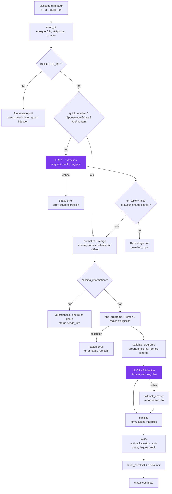

# Architecture — orchestrateur CivicPilot (Person 2)

Principe : **le LLM propose, le code dispose.** Le LLM n'intervient qu'à 2 étapes (en violet). Tout le reste est déterministe et testé sans appel réseau.

## Les 2 étapes LLM

| Étape | Fonction / prompt | Ce que le LLM fait | Ce que le code vérifie ensuite |
|---|---|---|---|
| 1. Extraction | `llm_json(EXTRACT_SYSTEM, …)` | Détecte la langue, remplit le profil, indique `on_topic`. | `normalize` : types, enums, âge de 15 à 99, montant > 0, masquage PII. `merge` : fusion sans effacer ce qui est connu. |
| 2. Rédaction | `llm_json(ANSWER_SYSTEM, …)` | Rédige le résumé, les raisons, le plan d'action et les suppositions, dans la langue de l'utilisateur. | `sanitize` puis `verify` : ids et liens réels uniquement, nom, type et sources recopiés depuis `find_programs`, garde anti-dette, risque de remboursement, forme du contrat. |

Le LLM ne décide **jamais** de l'éligibilité : c'est `find_programs` (règles de Person 3) qui calcule `match_status`.

## Ce qui est déterministe

- Masquage des données personnelles (`scrub_pii`) avant tout appel au LLM.
- Blocage des injections (`INJECTION_RE`), sans appel au LLM.
- Raccourci numérique (`quick_number`) : « 27 » ou « 3 000 dh » après la question correspondante, sans LLM.
- Stabilité de la langue : une réponse de moins de 3 mots garde la langue du tour précédent.
- Validation et fusion du profil (`normalize`, `merge`), calcul de `missing_information`.
- Questions de clarification : textes fixes dans 4 langues (`QUESTIONS`), une seule à la fois.
- Contrôle de la sortie de `rag.py` (`validate_programs`).
- Anti-hallucination, garde anti-dette, risques crédit, forme du contrat (`verify`).
- Checklist des documents (`build_checklist`), avertissement (`DISCLAIMERS`).

## Résilience

| Panne | Comportement | Visible dans |
|---|---|---|
| 429 / quota sur le modèle principal | Bascule automatique sur `LLM_FALLBACK_MODEL` (défaut `openai/gpt-oss-20b`), sans réessayer le modèle épuisé. | `trace.model_used` |
| Erreur hors quota (JSON invalide…) | Jusqu'à 2 nouvelles tentatives sur le même modèle, sans bascule. | — |
| LLM indisponible à l'étape 2 | `fallback_answer` construit la réponse à partir des seules données de `find_programs`. | `trace.llm_fallback_used = true` |
| LLM indisponible à l'étape 1 | `status: "error"` propre, profil conservé. | `trace.error_stage = "extraction"` |
| `find_programs` plante | `status: "error"` propre, pas d'exception côté API. | `trace.error_stage = "retrieval"` |
| Programme mal formé | Ignoré, les autres sont gardés. | `trace.invalid_programs` |

## Configuration

Variables lues dans `.env` (modèle : [.env.example](../.env.example)) : `LLM_PROVIDER` (groq, nvidia, ollama), la clé API, `LLM_MODEL`, `LLM_FALLBACK_MODEL` et `LLM_REASONING_EFFORT` (`low` par défaut, appliqué aux modèles gpt-oss).
